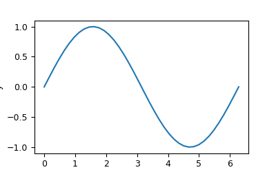
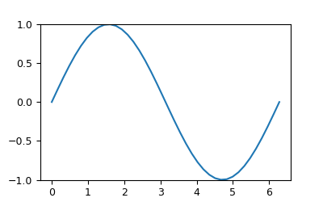
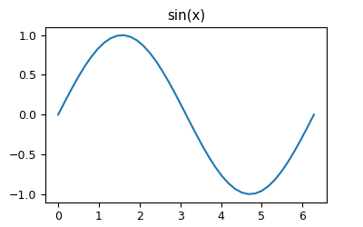
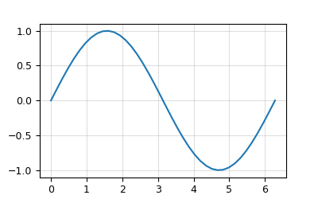
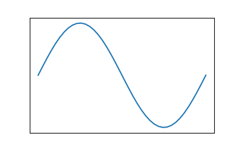

# axis

## Overview

Axis helpers on `MatplotGraphMaker` (`maker.set_label`, `maker.set_grid`, …). Optional kwargs use dataclasses under [`parameters/`](./parameters/).

[`AxisMixin`](./mixin.py) is mixed into `MatplotGraphMaker` together with [`DrawMixin`](../draw/mixin.py).

This page covers how to call those helpers through this library. For argument semantics and behavior not described here, see the [Matplotlib documentation](https://matplotlib.org/stable/api/index.html) for the underlying `Axes` methods (e.g. [`Axes.set_xlabel`](https://matplotlib.org/stable/api/_as_gen/matplotlib.axes.Axes.set_xlabel.html), [`Axes.grid`](https://matplotlib.org/stable/api/_as_gen/matplotlib.axes.Axes.grid.html)).

If something you need is missing from this package, open an [issue](https://github.com/ry-yoshida-private/MatplotlibUtilities/issues).

## API map

<table>
<thead>
<tr>
<th>Mixin</th>
<th>Methods on <code>MatplotGraphMaker</code></th>
</tr>
</thead>
<tbody>
<tr>
<td><a href="./mixin.py"><code>AxisMixin</code></a></td>
<td>
<ul>
<li><code>set_label</code></li>
<li><code>set_lim</code></li>
<li><code>set_title</code></li>
<li><code>set_grid</code></li>
<li><code>delete_axis_label</code></li>
</ul>
</td>
</tr>
</tbody>
</table>

## set_label

<table>
<tr>
<td width="420" valign="top"></td>
<td valign="top">

```python
import numpy as np
from matplotlib_utilities import GraphAxis, GraphLayout, GraphParameters, MatplotGraphMaker, TableAxis

layout = GraphLayout.from_number(number=1, axis=TableAxis.COLUMN, axis_value=1)
maker = MatplotGraphMaker(layout=layout, parameters=GraphParameters())
x = np.linspace(0, 2 * np.pi, 40)
idx = maker.get_subplot_index_from_number(number=0)
maker.plot(x=x, y=np.sin(x), index=idx)
maker.set_label(label="x", index=idx, axis=GraphAxis.X)
maker.set_label(label="y", index=idx, axis=GraphAxis.Y)
maker.finalize(save_path="out.png", is_showing_result_enabled=False)
```

</td>
</tr>
</table>

## set_lim

<table>
<tr>
<td width="420" valign="top"></td>
<td valign="top">

```python
import numpy as np
from matplotlib_utilities import GraphAxis, GraphLayout, GraphParameters, MatplotGraphMaker, TableAxis

layout = GraphLayout.from_number(number=1, axis=TableAxis.COLUMN, axis_value=1)
maker = MatplotGraphMaker(layout=layout, parameters=GraphParameters())
x = np.linspace(0, 2 * np.pi, 40)
idx = maker.get_subplot_index_from_number(number=0)
maker.plot(x=x, y=np.sin(x), index=idx)
maker.set_lim(lower=-1.0, upper=1.0, index=idx, axis=GraphAxis.Y)
maker.finalize(save_path="out.png", is_showing_result_enabled=False)
```

</td>
</tr>
</table>

## set_title

<table>
<tr>
<td width="420" valign="top"></td>
<td valign="top">

```python
import numpy as np
from matplotlib_utilities import GraphLayout, GraphParameters, MatplotGraphMaker, TableAxis

layout = GraphLayout.from_number(number=1, axis=TableAxis.COLUMN, axis_value=1)
maker = MatplotGraphMaker(layout=layout, parameters=GraphParameters())
x = np.linspace(0, 2 * np.pi, 40)
idx = maker.get_subplot_index_from_number(number=0)
maker.plot(x=x, y=np.sin(x), index=idx)
maker.set_title(title="sin(x)", index=idx)
maker.finalize(save_path="out.png", is_showing_result_enabled=False)
```

</td>
</tr>
</table>

## set_grid

<table>
<tr>
<td width="420" valign="top"></td>
<td valign="top">

```python
import numpy as np
from matplotlib_utilities import GraphLayout, GraphParameters, MatplotGraphMaker, TableAxis
from matplotlib_utilities.mixin.axis.parameters import GridParameters

layout = GraphLayout.from_number(number=1, axis=TableAxis.COLUMN, axis_value=1)
maker = MatplotGraphMaker(layout=layout, parameters=GraphParameters())
x = np.linspace(0, 2 * np.pi, 40)
idx = maker.get_subplot_index_from_number(number=0)
maker.plot(x=x, y=np.sin(x), index=idx)
maker.set_grid(index=idx, subparams=GridParameters(alpha=0.4))
maker.finalize(save_path="out.png", is_showing_result_enabled=False)
```

</td>
</tr>
</table>

## delete_axis_label

<table>
<tr>
<td width="420" valign="top"></td>
<td valign="top">

```python
import numpy as np
from matplotlib_utilities import GraphLayout, GraphParameters, MatplotGraphMaker, TableAxis
from matplotlib_utilities.mixin.axis.parameters import TickParamsParameters

layout = GraphLayout.from_number(number=1, axis=TableAxis.COLUMN, axis_value=1)
maker = MatplotGraphMaker(layout=layout, parameters=GraphParameters())
x = np.linspace(0, 2 * np.pi, 40)
idx = maker.get_subplot_index_from_number(number=0)
maker.plot(x=x, y=np.sin(x), index=idx)
maker.delete_axis_label(
    index=idx,
    subparams=TickParamsParameters(labelbottom=False, labelleft=False),
)
maker.finalize(save_path="out.png", is_showing_result_enabled=False)
```

</td>
</tr>
</table>
