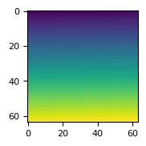
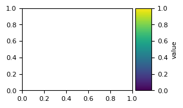
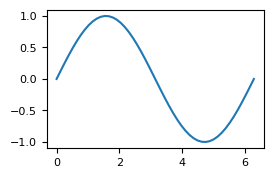
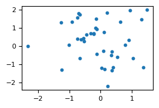
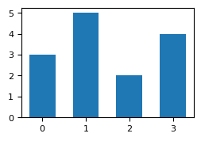
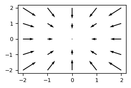
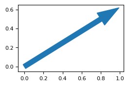
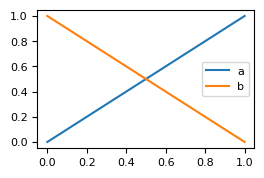
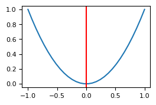
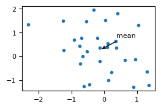

# draw

## Overview

Drawing helpers on `MatplotGraphMaker` (`maker.scatter`, `maker.imshow`, …). Parameters live under [`parameters/`](./parameters/).

`DrawMixin` composes the mixins under [`mixins/`](./mixins/) and adds a few methods on [`mixin.py`](./mixin.py).

This page covers how to call those helpers through this library. For argument semantics, styling options, and behavior not described here, see the [Matplotlib documentation](https://matplotlib.org/stable/api/index.html) for the underlying `Axes` methods (e.g. [`Axes.scatter`](https://matplotlib.org/stable/api/_as_gen/matplotlib.axes.Axes.scatter.html)).

If something you need is missing from this package, open an [issue](https://github.com/ry-yoshida-private/MatplotlibUtilities/issues).

## API map

<table>
<thead>
<tr>
<th>Mixin</th>
<th>Methods on <code>MatplotGraphMaker</code></th>
</tr>
</thead>
<tbody>
<tr>
<td><a href="./mixins/image.py"><code>ImageDrawMixin</code></a></td>
<td>
<ul>
<li><code>imshow</code></li>
<li><code>set_colorbar</code></li>
</ul>
</td>
</tr>
<tr>
<td><a href="./mixins/series.py"><code>SeriesDrawMixin</code></a></td>
<td>
<ul>
<li><code>plot</code></li>
<li><code>scatter</code></li>
<li><code>bar</code></li>
</ul>
</td>
</tr>
<tr>
<td><a href="./mixins/vector.py"><code>VectorDrawMixin</code></a></td>
<td>
<ul>
<li><code>arrow</code></li>
<li><code>quiver</code></li>
</ul>
</td>
</tr>
<tr>
<td><a href="./mixin.py"><code>DrawMixin</code></a></td>
<td>
<ul>
<li><code>legend</code></li>
<li><code>line</code></li>
<li><code>annotate</code></li>
<li><code>imscatter</code> — not implemented</li>
<li><code>hist</code> — not implemented</li>
</ul>
</td>
</tr>
</tbody>
</table>

## imshow

<table>
<tr>
<td width="220" valign="top"></td>
<td valign="top">

```python
import numpy as np
from matplotlib_utilities import GraphLayout, GraphParameters, ImshowParameters, MatplotGraphMaker, TableAxis

layout = GraphLayout.from_number(number=1, axis=TableAxis.COLUMN, axis_value=1)
maker = MatplotGraphMaker(layout=layout, parameters=GraphParameters())
data = np.linspace(0, 1, 64 * 64).reshape(64, 64)
idx = maker.get_subplot_index_from_number(number=0)
maker.imshow(image=data, index=idx, subparams=ImshowParameters())
maker.finalize(save_path="out.png", is_showing_result_enabled=False)
```

</td>
</tr>
</table>

## set_colorbar

<table>
<tr>
<td width="220" valign="top"></td>
<td valign="top">

```python
import numpy as np
from matplotlib_utilities import ColorbarParameters, GraphLayout, GraphParameters, MatplotGraphMaker, TableAxis

layout = GraphLayout.from_number(number=1, axis=TableAxis.COLUMN, axis_value=1)
maker = MatplotGraphMaker(layout=layout, parameters=GraphParameters())
data = np.linspace(0, 1, 32 * 32).reshape(32, 32)
idx = maker.get_subplot_index_from_number(number=0)
maker.set_colorbar(index=idx, image=data, subparams=ColorbarParameters(label="value"))
maker.finalize(save_path="out.png", is_showing_result_enabled=False)
```

</td>
</tr>
</table>

## plot

<table>
<tr>
<td width="220" valign="top"></td>
<td valign="top">

```python
import numpy as np
from matplotlib_utilities import GraphLayout, GraphParameters, MatplotGraphMaker, PlotParameters, TableAxis

layout = GraphLayout.from_number(number=1, axis=TableAxis.COLUMN, axis_value=1)
maker = MatplotGraphMaker(layout=layout, parameters=GraphParameters())
x = np.linspace(0, 2 * np.pi, 50)
idx = maker.get_subplot_index_from_number(number=0)
maker.plot(x=x, y=np.sin(x), index=idx, subparams=PlotParameters())
maker.finalize(save_path="out.png", is_showing_result_enabled=False)
```

</td>
</tr>
</table>

## scatter

<table>
<tr>
<td width="220" valign="top"></td>
<td valign="top">

```python
import numpy as np
from matplotlib_utilities import GraphLayout, GraphParameters, MatplotGraphMaker, ScatterParameters, TableAxis

layout = GraphLayout.from_number(number=1, axis=TableAxis.COLUMN, axis_value=1)
maker = MatplotGraphMaker(layout=layout, parameters=GraphParameters())
rng = np.random.default_rng(0)
x, y = rng.standard_normal(40), rng.standard_normal(40)
idx = maker.get_subplot_index_from_number(number=0)
maker.scatter(x=x, y=y, index=idx, subparams=ScatterParameters(s=40))
maker.finalize(save_path="out.png", is_showing_result_enabled=False)
```

</td>
</tr>
</table>

## bar

<table>
<tr>
<td width="220" valign="top"></td>
<td valign="top">

```python
import numpy as np
from matplotlib_utilities import GraphLayout, GraphParameters, MatplotGraphMaker, TableAxis
from matplotlib_utilities.mixin.draw.parameters import BarParameters

layout = GraphLayout.from_number(number=1, axis=TableAxis.COLUMN, axis_value=1)
maker = MatplotGraphMaker(layout=layout, parameters=GraphParameters())
idx = maker.get_subplot_index_from_number(number=0)
maker.bar(
    x=np.arange(4.0),
    index=idx,
    subparams=BarParameters(height=[3.0, 5.0, 2.0, 4.0], width=0.6),
)
maker.finalize(save_path="out.png", is_showing_result_enabled=False)
```

</td>
</tr>
</table>

## quiver

<table>
<tr>
<td width="220" valign="top"></td>
<td valign="top">

```python
import numpy as np
from matplotlib_utilities import (
    GraphLayout,
    GraphParameters,
    MatplotGraphMaker,
    QuiverAngles,
    QuiverParameters,
    TableAxis,
)

layout = GraphLayout.from_number(number=1, axis=TableAxis.COLUMN, axis_value=1)
maker = MatplotGraphMaker(layout=layout, parameters=GraphParameters())
x = np.linspace(-2, 2, 5)
y = np.linspace(-2, 2, 5)
xx, yy = np.meshgrid(x, y)
idx = maker.get_subplot_index_from_number(number=0)
maker.quiver(
    u=-xx,
    v=-yy,
    x=xx,
    y=yy,
    index=idx,
    subparams=QuiverParameters(angles=QuiverAngles.XY, scale=20.0),
)
maker.finalize(save_path="out.png", is_showing_result_enabled=False)
```

</td>
</tr>
</table>

## arrow

<table>
<tr>
<td width="220" valign="top"></td>
<td valign="top">

```python
from matplotlib_utilities import ArrowParameters, GraphLayout, GraphParameters, MatplotGraphMaker, TableAxis

layout = GraphLayout.from_number(number=1, axis=TableAxis.COLUMN, axis_value=1)
maker = MatplotGraphMaker(layout=layout, parameters=GraphParameters())
idx = maker.get_subplot_index_from_number(number=0)
maker.arrow(x=0.0, y=0.0, dx=0.8, dy=0.5, index=idx, subparams=ArrowParameters(width=0.05, color="C0"))
maker.finalize(save_path="out.png", is_showing_result_enabled=False)
```

</td>
</tr>
</table>

## legend

<table>
<tr>
<td width="220" valign="top"></td>
<td valign="top">

```python
import numpy as np
from matplotlib_utilities import GraphLayout, GraphParameters, MatplotGraphMaker, PlotParameters, TableAxis

layout = GraphLayout.from_number(number=1, axis=TableAxis.COLUMN, axis_value=1)
maker = MatplotGraphMaker(layout=layout, parameters=GraphParameters())
x = np.linspace(0, 1, 20)
idx = maker.get_subplot_index_from_number(number=0)
maker.plot(x=x, y=x, index=idx, subparams=PlotParameters(label="a"))
maker.plot(x=x, y=1 - x, index=idx, subparams=PlotParameters(label="b"))
maker.legend(index=idx)
maker.finalize(save_path="out.png", is_showing_result_enabled=False)
```

</td>
</tr>
</table>

## line

<table>
<tr>
<td width="220" valign="top"></td>
<td valign="top">

```python
import numpy as np
from matplotlib_utilities import GraphLayout, GraphParameters, LineParameters, MatplotGraphMaker, Orientation, TableAxis

layout = GraphLayout.from_number(number=1, axis=TableAxis.COLUMN, axis_value=1)
maker = MatplotGraphMaker(layout=layout, parameters=GraphParameters())
x = np.linspace(-1, 1, 30)
idx = maker.get_subplot_index_from_number(number=0)
maker.plot(x=x, y=x**2, index=idx)
maker.line(value=0.0, orientation=Orientation.VERTICAL, index=idx, subparams=LineParameters(color="red"))
maker.finalize(save_path="out.png", is_showing_result_enabled=False)
```

</td>
</tr>
</table>

## annotate

<table>
<tr>
<td width="220" valign="top"></td>
<td valign="top">

```python
import numpy as np
from matplotlib_utilities import AnnotateParameters, GraphLayout, GraphParameters, MatplotGraphMaker, TableAxis

layout = GraphLayout.from_number(number=1, axis=TableAxis.COLUMN, axis_value=1)
maker = MatplotGraphMaker(layout=layout, parameters=GraphParameters())
rng = np.random.default_rng(0)
x, y = rng.standard_normal(30), rng.standard_normal(30)
idx = maker.get_subplot_index_from_number(number=0)
maker.scatter(x=x, y=y, index=idx)
maker.annotate(
    text="mean",
    xy=(float(np.mean(x)), float(np.mean(y))),
    index=idx,
    xytext=(float(np.mean(x)) + 0.5, float(np.mean(y)) + 0.5),
    subparams=AnnotateParameters(arrowprops={"arrowstyle": "->"}),
)
maker.finalize(save_path="out.png", is_showing_result_enabled=False)
```

</td>
</tr>
</table>
